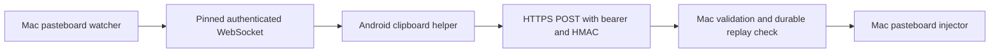

<div align="center">
  
  <h1>ClipSync — native Mac + Android fork</h1>
  <p>Clipboard text and images between an awake Mac and Android over a private network.</p>
</div>

This [sintezcs fork](https://github.com/sintezcs/clip-sync) develops the native Swift/macOS and Kotlin/Android applications from [2cristo7/clip-sync](https://github.com/2cristo7/clip-sync). It focuses on explicit pairing trust, predictable clipboard behavior and an adaptive Android interface for One UI and foldable screens.

**The hardened fork has no published binary yet.** Build the current source locally. Upstream releases, old screenshots and historical installation guides do not represent this implementation. The repository's release installer is not a substitute for a verified build of this branch.

## What it does

- Synchronizes clipboard text and supported images (PNG/JPEG, plus Android9+ HEIC/HEIF converted to JPEG) in both directions when the devices are connected and clipboard access is ready.
- Provides an explicit Android share target for a single text or supported image item.
- Shows connection, pairing, notification and Shizuku readiness separately, with compact and expanded Android layouts, dark/light themes and larger-text support.
- Supports pause, disconnect and pairing removal on Android, and pause and paired-device revocation from the Mac menu bar.
- Finds nearby Macs through Bonjour/mDNS and accepts a manually entered reachable address, including a private VPN address.

Automatic Android clipboard access uses a Shizuku helper started through wireless debugging or ADB. It does not require root or replacing your keyboard. Android background clipboard restrictions still apply when the helper is unavailable; the UI exposes readiness and explicit actions instead of claiming background access works.

There is no screenshot monitoring or background screenshot capture. Generic file transfer and automatic saving of received files into Documents are removed. A screenshot explicitly copied to the clipboard can travel as a supported image, just like another clipboard image.

## Set up a local build

Requirements:

| Component | Requirement |
| --- | --- |
| Mac runtime | macOS 14 or newer; awake and reachable while syncing |
| Mac development | Xcode 26.3; command-scoped `DEVELOPER_DIR`; deployment target 14.0 |
| Android runtime | App minimum Android 8/API 26; background helper support depends on device and Shizuku readiness |
| Android development | JDK 17 and the Android SDK; Gradle wrapper included |
| Network | Private LAN or reachable private VPN connection; no public port forwarding required |

Build the Mac application from the repository root:

```bash
DEVELOPER_DIR=/Applications/Xcode.app/Contents/Developer xcodebuild build \
  -project mac/ClipSync.xcodeproj \
  -scheme ClipSync \
  -configuration Debug \
  -destination 'platform=macOS' \
  -derivedDataPath build/mac-local \
  -onlyUsePackageVersionsFromResolvedFile \
  MACOSX_DEPLOYMENT_TARGET=14.0 ONLY_ACTIVE_ARCH=YES \
  DEVELOPMENT_TEAM='' CODE_SIGN_IDENTITY=- \
  CODE_SIGNING_REQUIRED=YES CODE_SIGNING_ALLOWED=YES ENABLE_HARDENED_RUNTIME=NO
```

Use a fresh `build/mac-local` directory that has never held test builds. The app is at `build/mac-local/Build/Products/Debug/ClipSync.app`. Opening it starts the actual menu-bar application and its clipboard/network functionality. This is a local ad hoc Debug build with a command-local runtime setting for development without a signing identity; the project's Release hardening remains enabled. It is not a distribution release. See [local packaging and signing](docs/development/native-verification.md#local-packaging-and-signing-boundary) before installation.

Build Android:

```bash
cd android
./gradlew :app:assembleDebug
```

The APK is `android/app/build/outputs/apk/debug/app-debug.apk`, relative to the repository root. Transfer it to your device and install it, or select your intended device explicitly with ADB:

```bash
adb devices
adb -s YOUR_DEVICE_SERIAL install -r android/app/build/outputs/apk/debug/app-debug.apk
```

Run the ADB commands from the repository root and replace `YOUR_DEVICE_SERIAL` with the device you intend to modify. A build signed differently from an existing installation cannot update it in place; removing an installation also removes its local pairing state.

Install and start Shizuku using its manager's wireless-debugging or ADB setup, then grant ClipSync access in that manager. Shizuku normally needs starting again after a phone reboot. In ClipSync, enable the requested notification permission, check the displayed helper/clipboard readiness and enable synchronization. You can continue using your existing keyboard.

## Pair with your Mac

1. On its first ready launch, an unpaired Mac offers the pairing window. You can also open it from the menu bar while both devices can reach each other. Dismissing it does not cause reconnects to reopen it.
2. On Android, open the Mac's v2 QR link or enter the Mac address, port and six-digit code manually.
3. Compare the **complete SPKI fingerprint** with the value on your trusted Mac's screen, then explicitly confirm pairing on Android.
4. Check connection and clipboard readiness before testing with non-sensitive text.

Discovery and a received link are not proof of identity. The fingerprint is verified before credentials are exchanged; there is no trust-on-first-use fallback. QR pairing uses a single-use random secret sent by pinned HTTPS POST. Manual pairing retains the code endpoint, also protected by the independently verified pin. Refreshing or closing the Mac pairing session invalidates its previous enrollment credentials.

For a private VPN, enter the Mac's reachable VPN address manually; multicast discovery generally does not cross that connection. The Mac must remain awake and reachable. The app provides no cloud relay or durable offline-delivery queue.

## Native architecture and security



The Mac runs a native menu-bar application and a TLS-only Hummingbird server. Android uses a foreground connection service, a privileged Shizuku clipboard helper and explicit user actions where background access is unavailable. A successful listener bind precedes advertisement; startup failures in TLS identity, secrets or token storage do not fall back to an insecure listener.

Credentials use macOS Keychain and Android encrypted storage. Payloads have strict MIME, base64, byte-size, image-dimension, nonce and timestamp validation. Text is limited to 1 MiB, images to 8 MiB and 24 million pixels. Durable replay records are written before clipboard effects, and incoming echoes are checked before application. Revocation is checked at the actual Mac clipboard write.

The devices need synchronized clocks. HTTP authentication timestamps permit less than 60 seconds of skew. Sends do not automatically retry: a lost response or cancellation can leave delivery unconfirmed. A durable acceptance record is not proof that the clipboard write completed; this is not an exactly-once delivery guarantee. See [the current protocol contract](docs/protocol-v2.md) for wire details, replay responses and limits.

## Development and verification

Use the isolated harnesses from the repository root:

```bash
./scripts/verify-macos.sh
./scripts/verify-android.sh
```

Read [native verification](docs/development/native-verification.md) and [Android verification](docs/development/android-verification.md) before running them. The Mac harness isolates build outputs and excludes the separately coordinated native bridge fixture by default. Clipboard tests use fake or uniquely named Mac pasteboards and synthetic data. The Android harness uses a dedicated audit emulator and checks its identity before installation or instrumentation.

The tracked Swift package lockfile makes the resolved graph reviewable. Hosted tests avoid a separate `HummingbirdTesting` product dependency because it triggered broken dynamic package linking in Xcode; route tests use direct HTTP fixtures. The verification guide records the reproduced failure and remedy.

The final Mac suite passed 92 tests, and the opt-in pairing-window visual test passed with QR/image review. Actual native text and PNG pixel checks passed in both directions on the audit emulator and a physical Fold over USB, with Android backgrounded and using Shizuku. Android has 84 passing JVM tests. The rich-text revision default instrumentation runner reported `OK (21 tests)` (16 executed checks and five opt-in skips); opt-in cases skipped in that run are not claimed as executed. Two real-Shizuku checks and the native bridge checks passed in their separate explicit runs. A separate normal-pairing LAN run also passed text and PNG both directions using the Mac system clipboard; a rich-text LAN regression failed before normalization and passed after it. The user confirmed Telegram text copy works. These checks do not establish daily-use reliability. The universal Mac Release build passed, but its ad hoc hardened-runtime launch failed library validation on macOS 15.7.5. A usable signing identity and release runtime verification remain open. A clean app-only Debug package passed signature checks, was installed and started after user-approved Keychain access; its LAN listener and Bonjour are live. Normal LAN pairing and synthetic clipboard validation are complete; HEIC conversion passed synthetic LAN and physical decoder tests; real Gallery paste is the current provider-specific follow-up. Consult the [handoff](docs/handoff/android-implementation-progress.md) and [hardening plan](docs/plans/2026-09-11-fork-hardening.md) for scoped evidence rather than treating this README as a release certification.

Physical One UI cover and unfolded inner-display review passed, along with four physical UI tests; the broader folding/rotation/accessibility matrix remains open. Remaining gates include normal LAN setup, the wider third-party image-provider matrix, accessibility/performance and a 48-hour soak. Battery and latency have not been measured. Android's WebSocket library can allocate incoming messages before application size validation; payload limits do not eliminate that allocation exposure. Release signing, notarization and a hardened binary release remain separate work.

## Repository

- `mac/` — native Swift app, TLS server, pairing, clipboard and XCTest sources.
- `android/` — native Kotlin/Compose app, foreground service, Shizuku helper and tests.
- `scripts/` — isolated native verification harnesses.
- `docs/protocol-v2.md` — current native wire contract.
- `docs/development/` and `docs/handoff/` — verification instructions and continuation evidence.
- `docs/reviews/` — original audit and implementation reviews.

Older architecture documents, release guides, screenshots and cross-platform rewrite plans remain historical references. They do not promise current generic-file transfer, screenshot automation, permissive pairing or a supported Rust product.

## Contributing and license

Report fork issues at [sintezcs/clip-sync](https://github.com/sintezcs/clip-sync/issues). Preserve upstream attribution and include relevant verification evidence with changes.

MIT — see [LICENSE](LICENSE). Based on [2cristo7/clip-sync](https://github.com/2cristo7/clip-sync), with contributions by the ClipSync contributors and this fork.
